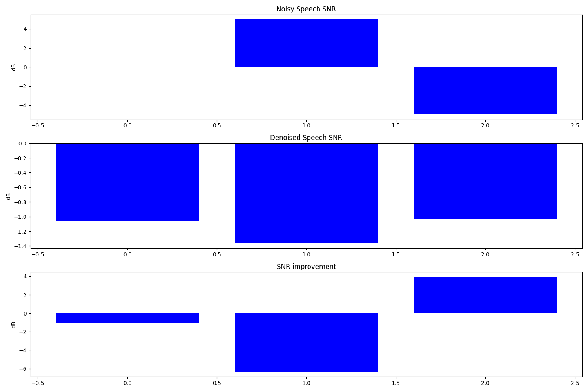
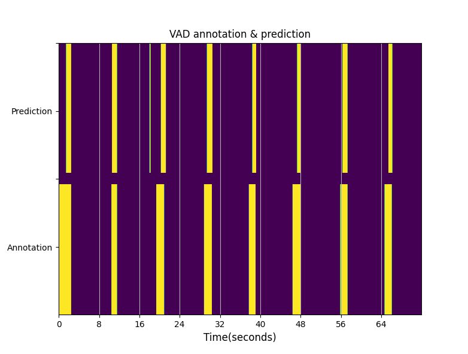

# TF Keras RNNoise Speech Denoise/VAD Model

## Introduction

An end-to-end RNNoise speech denoise/vad model build pipeline for 16K sample rate audio. Implement with tf.keras, including model training/tuning, model evaluation, trained model export (ONNX) and on device deployment (C/CPP).


## Guide of train/evaluate/demo

### Train

1. Install requirements on Ubuntu 22.04/24.04:

```
# pip install -r requirements.txt
```

2. Prepare dataset for train

    * Get .wav format clean speech & noise audio data (single channel, 16k sample rate, 16-bit width) and place at `<dataset path>/` with 1 folder for speech & 1 folder for noise, like:

    ```
    <dataset path>/
    ├── noise
    │   ├── noise_1.wav
    │   ├── noise_2.wav
    │   ├── noise_3.wav
    │   └── ...
    │
    └── speech
        ├── speech_1.wav
        ├── speech_2.wav
        ├── speech_3.wav
        └── ...
    ```

    * Run `rnnoise_16k/src/compile.sh` to build training data generator tool, then use it to generate speech & noise mixed wav file with random signal-to-noise ratio (SNR) & corresponding audio feature matrix .bin file:

    ```
    # cd ../src/
    # ./compile.sh
    # ./denoise_train_data_creator -h
    Usage: denoise_train_data_creator
    --speech_path, -s: path for speech wav audio file. default: ./speech/
    --noise_path, -n: path for noise wav audio file. default: ./noise/
    --loop_num, -l: generate loop number. default: 10000
    --output_audio_file, -a: output mixed wav audio file. default: mixed.wav
    --output_feature_file, -f: output audio feature matrix file. default: train_data_16k_f32.bin
    --verbose, -v: whether to display audio feature details (0|1). default: 0

    # ./denoise_train_data_creator -s <dataset path>/speech/ -n <dataset path>/noise/
    ...
    [####################################################################################################] 100.0%
    Done. mixed audio has been saved to 'mixed.wav', audio feature data has been saved to 'train_data_16k_f32.bin'
    feature matrix shape: 10000 x 75
    ```

    * Use `bin2hdf5.py` to convert .bin format audio feature matrix to hdf5/h5 format file, for further training:

    ```
    # cd ../training/
    # python bin2hdf5.py -h
    usage: bin2hdf5.py [-h] --input_bin_file INPUT_BIN_FILE [--matrix_shape MATRIX_SHAPE] [--output_h5_file OUTPUT_H5_FILE]
    tool to convert audio feature matrix from bin file to h5
    options:
      -h, --help            show this help message and exit
      --input_bin_file INPUT_BIN_FILE
                            input audio feature matrix bin file, default=None
      --matrix_shape MATRIX_SHAPE
                            feature matrix shape as <feature_number>x<feature_length>, default=10000x75
      --output_h5_file OUTPUT_H5_FILE
                            output h5 format feature matrix file. default=train_data.h5

    # python bin2hdf5.py --input_bin_file=../src/train_data_16k_f32.bin --matrix_shape=10000x75 --output_h5_file=train_data.h5
    Done. Audio feature matrix has been saved to train_data.h5
    ```

    * To annotate speech timestamp (start/stop time of a speech segment) info of audio file for VAD evaluation, you can use [SubtitleEdit](https://www.nikse.dk/subtitleedit) to load & edit .srt format subtitle file & corresponding audio file. With 4.0.13 & later version, you can even use Whisper ASR large model inside SubtitleEdit to automatically generate subtitle info for an audio. For plenty of audio files, [whisper_to_srt.py](https://github.com/david8862/rnnoise_16k/blob/master/training_new/tools/dataset_converter/whisper_to_srt.py) can be used to batch generate .srt format subtitle files. Then you can use [srt_to_txt.py](https://github.com/david8862/rnnoise_16k/blob/master/training_new/tools/dataset_converter/srt_to_txt.py) to convert the subtitle file to voice timestamp txt file.

    ```
    # cd tools/dataset_converter/
    # python whisper_to_srt.py -h
    usage: whisper_to_srt.py [-h] --input_audio_path INPUT_AUDIO_PATH
                             [--model_type {tiny.en,tiny,base.en,base,small.en,small,medium.en,medium,large-v1,large-v2,large-v3,large,large-v3-turbo,turbo}]
                             [--language {None,zh,en,fr,de,it,es,ja,ko,ru,tr,th}]
                             [--no_speech_threshold NO_SPEECH_THRESHOLD]
                             [--fp16]
                             [--output_path OUTPUT_PATH]

    tool to generate .srt subtitle file with OpenAI Whisper model

    options:
      -h, --help            show this help message and exit
      --input_audio_path INPUT_AUDIO_PATH
                            file or directory for input .wav audio files
      --model_type {tiny.en,tiny,base.en,base,small.en,small,medium.en,medium,large-v1,large-v2,large-v3,large,large-v3-turbo,turbo}
                            Whisper model type to use. default=large-v3-turbo
      --language {None,zh,en,fr,de,it,es,ja,ko,ru,tr,th}
                            Target language to transcribe, None for auto-detect. default=None
      --no_speech_threshold NO_SPEECH_THRESHOLD
                            threshold to judge if an audio segment contains speech. default=0.8
      --fp16                Whether to use fp16 inference. default=False
      --output_path OUTPUT_PATH
                            output path to save .srt subtitle files. default=output

    # python whisper_to_srt.py --input_audio_path=<dataset path>/speech/ --model_type=large-v3-turbo --language=tr --output_path=<dataset path>/subtitle/


    # python srt_to_txt.py -h
    usage: srt_to_txt.py [-h] --input_audio_path INPUT_AUDIO_PATH
                         --input_srt_path INPUT_SRT_PATH
                         [--output_path OUTPUT_PATH]

    Tool to convert .srt audio subtitle text file to voice timestamp txt file

    options:
      -h, --help            show this help message and exit
      --input_audio_path INPUT_AUDIO_PATH
                            file or directory for input wav audio file
      --input_srt_path INPUT_SRT_PATH
                            file or directory for input .srt subtitle text file
      --output_path OUTPUT_PATH
                            output path to save voice timestamp txt file. default=output

    # python srt_to_txt.py --input_audio_path=<dataset path>/speech/ --input_srt_path=<dataset path>/subtitle/ --output_path=<dataset path>/annotation/

    ```


3. [train.py](https://github.com/david8862/rnnoise_16k/blob/master/training_new/train.py)

```
# python train.py -h
usage: train.py [-h] [--bands_num BANDS_NUM] [--delta_ceps_num DELTA_CEPS_NUM]
                [--sequence_length SEQUENCE_LENGTH]
                [--weights_path WEIGHTS_PATH]
                --train_data_file TRAIN_DATA_FILE
                [--val_split VAL_SPLIT]
                [--batch_size BATCH_SIZE]
                [--optimizer {adam,rmsprop,sgd}]
                [--learning_rate LEARNING_RATE]
                [--decay_type {None,cosine,exponential,polynomial,piecewise_constant}]
                [--init_epoch INIT_EPOCH]
                [--transfer_epoch TRANSFER_EPOCH]
                [--total_epoch TOTAL_EPOCH]

train RNNoise model

options:
  -h, --help            show this help message and exit
  --bands_num BANDS_NUM
                        number of bands, default=18
  --delta_ceps_num DELTA_CEPS_NUM
                        number of delta ceps, default=6
  --sequence_length SEQUENCE_LENGTH
                        input sequence length, default=2000
  --weights_path WEIGHTS_PATH
                        Pretrained model/weights file for fine tune
  --train_data_file TRAIN_DATA_FILE
                        h5 file for training dataset
  --val_split VAL_SPLIT
                        validation data persentage in dataset, default=0.1
  --batch_size BATCH_SIZE
                        batch size for train, default=64
  --optimizer {adam,rmsprop,sgd}
                        optimizer for training (adam/rmsprop/sgd), default=adam
  --learning_rate LEARNING_RATE
                        Initial learning rate, default=0.001
  --decay_type {None,cosine,exponential,polynomial,piecewise_constant}
                        Learning rate decay type, default=None
  --init_epoch INIT_EPOCH
                        Initial training epochs for fine tune training, default=0
  --transfer_epoch TRANSFER_EPOCH
                        Transfer training (from Imagenet) stage epochs, default=5
  --total_epoch TOTAL_EPOCH
                        Total training epochs, default=100
```

Following is reference config cmd for training:
```
# python train.py --bands_num=18 --delta_ceps_num=6 --sequence_length=2000 --train_data_file=../training/train_data.h5 --weights_path=../training/models/weights-improvement-95-0.02729.hdf5 --val_split=0.1 --decay_type=cosine --transfer_epoch=5 --total_epoch=100
```
or training on GPU 0, 1 and 2, if you have several GPUs on your host/server:
```
# CUDA_VISIBLE_DEVICES=0,1,2 python train.py --bands_num=18 --delta_ceps_num=6 --sequence_length=2000 --train_data_file=../training/train_data.h5 --weights_path=../training/models/weights-improvement-95-0.02729.hdf5 --val_split=0.1 --decay_type=cosine --transfer_epoch=5 --total_epoch=100
```

Checkpoints during training could be found at `logs/000/`. Choose a best one as result

You can also use Tensorboard to monitor the loss trend during train:
```
# tensorboard --logdir=logs/000
```

### Model dump
You can use [keras_to_c.py](https://github.com/david8862/rnnoise_16k/blob/master/training_new/tools/model_converter/keras_to_c.py) to dump out model weights from h5 training checkpoint to C code, for further lib/sample build & evaluation:

```
# cd tools/model_converter/
# python keras_to_c.py -h
usage: keras_to_c.py [-h] --keras_model_file KERAS_MODEL_FILE
                          [--output_code_file OUTPUT_CODE_FILE]
                          [--output_header_file OUTPUT_HEADER_FILE]

Dump RNNoise/RNNVad keras model weights to c code & header file

options:
  -h, --help            show this help message and exit
  --keras_model_file KERAS_MODEL_FILE
                        path to keras model file
  --output_code_file OUTPUT_CODE_FILE
                        output c code file, default=rnn_data.c
  --output_header_file OUTPUT_HEADER_FILE
                        output c header file, default=rnn_data.h

# python keras_to_c.py
    --keras_model_file="path/to/keras/model.h5"
    --output_code_file=rnn_data.c
    --output_header_file=rnn_data.h
```
The generated "rnn_data.c" & "rnn_data.h" could be used to replace corresponding code file under `src/` path.

### Inference
With new tranied model weights in `src/rnn_data.c`, we can build rnnoise lib & samples for inference:

```
# cd ..
# mkdir build && cd build
# cmake [-DCMAKE_TOOLCHAIN_FILE=<cross-compile toolchain file>]
        [-DRNNOISE_BUILD_SHARED_LIBS=OFF] ..
# make && make install
```

The built rnnoise & rnnvad sample could be found at `build/install/bin/samples/`, which can be used for inference with .wav audio:

```
# cd build/install/bin/samples/
# ./rnnoise_sample -h
Usage: rnnoise_sample
--input_file, -i: input raw audio file. default: 'input.wav'
--chunk_size,  -c: audio chunk size to read every time. default: 640
--output_file, -o: output pcm file for denoised audio. default: output.pcm

# ./rnnoise_sample -i input.wav -o denoise.pcm
NOTE: RNNoise lib only support single channel, 16k sample rate, 16-bit audio data!
sample number of input audio is 1088022
chunk number is 1700
[################################################################################################### ] 99.0%
Process finished.

# ./rnnvad_postprocess_stream_sample -h
Usage: rnnvad_postprocess_stream_sample
--input_file, -i: input raw audio file. default: 'input.wav'
--chunk_size, -c: audio chunk size to read every time. default: 640
--output_file, -o: output txt file for voice timestamps. default: output.txt

# ./rnnvad_postprocess_stream_sample -vad_eval.pngi input.wav -o vad_result.txt
NOTE: RNNoise lib only support single channel, 16k sample rate, 16-bit audio data!
sample number of input audio is 1088022
chunk number is 1700
[################################################################################################### ] 99.0%
Process finished.
```
The rnnoise sample will generate a denoised pcm audio file (single channel, 16k, 16 bit), and the rnnvad sample will generate a voice timestamps txt file like:

```
# cat vad_result.txt
16000               // sample rate
8525.995            // total duration time (in seconds)
197.949,199.200     // voice start/stop time (in seconds)
200.159,202.829
...
```

### Evaluation
For rnnoise sample, you can use [denoise_eval.py](https://github.com/david8862/rnnoise_16k/blob/master/training_new/tools/evaluation/denoise_eval.py) to evaluate Denoise related metric (SNR/PESQ/STOI/etc):

```
# cd tools/evaluation/
# python denoise_eval.py -h
usage: denoise_eval.py [-h] --clean_voice_path CLEAN_VOICE_PATH
                            --noisy_voice_path NOISY_VOICE_PATH
                            --denoised_voice_path DENOISED_VOICE_PATH
                            [--metric_type {SNR,SI-SNR,SI-SDR,PESQ,STOI}]
                            [--sample_rate {None,8000,16000,22050,44100,48000}]
                            [--visualize]

tool to evaluate Denoise metrics

options:
  -h, --help            show this help message and exit
  --clean_voice_path CLEAN_VOICE_PATH
                        file or directory for original clean voice audio
  --noisy_voice_path NOISY_VOICE_PATH
                        file or directory for noisy voice audio
  --denoised_voice_path DENOISED_VOICE_PATH
                        file or directory for denoised voice audio
  --metric_type {SNR,SI-SNR,SI-SDR,PESQ,STOI}
                        voice quality metric type, default=SNR
  --sample_rate {None,8000,16000,22050,44100,48000}
                        (optional) target sample rate, None is unchange. default=None
  --visualize           Whether to visualize denoise metric result

# python denoise_eval.py --clean_voice_path=<dataset path>/speech/ --noisy_voice_path=<dataset path>/noisy/ --denoised_voice_path=<dataset path>/denoised/ --metric_type=SNR --visualize
Denoise evaluation: 100%|████████████████████████████████████████████████████████████████████████████████████████████████| 3/3 [00:01<00:00,  2.92it/s]
Metric type: SNR
average noisy SNR: 0.008044878952205181 dB
average denoised SNR: -1.1493064165115356 dB
average SNR improvement: -1.1573511362075806 dB
```
<p align="center">
  
</p>


For rnnvad sample, you can use [vad_eval.py](https://github.com/david8862/rnnoise_16k/blob/master/training_new/tools/evaluation/vad_eval.py) to evaluate VAD related metric (match rate/accuracy/F1 score/etc):

```
# cd tools/evaluation/
# python vad_eval.py -h
usage: vad_eval.py [-h] --annotation_txt_path ANNOTATION_TXT_PATH
                        --result_txt_path RESULT_TXT_PATH
                        [--min_silence_duration MIN_SILENCE_DURATION]
                        [--overlap_threshold OVERLAP_THRESHOLD]
                        [--visualize]

tool to evaluate VAD metrics

options:
  -h, --help            show this help message and exit
  --annotation_txt_path ANNOTATION_TXT_PATH
                        file or directory for voice timestamp annotation txt file
  --result_txt_path RESULT_TXT_PATH
                        file or directory for voice timestamp detect result txt file
  --min_silence_duration MIN_SILENCE_DURATION
                        minimum silence sample number to start a new voice segment. default=30
  --overlap_threshold OVERLAP_THRESHOLD
                        threshold of overlap rate for result segment to match an annotation segment. default=0.3
  --visualize           Whether to visualize VAD result


# python vad_eval.py --annotation_txt_path=vad_annotation.txt --result_txt_path=vad_result.txt --visualize
VAD evaluation: 100%|███████████████████████████████████████████████████████████████████████████████████████████████| 1/1 [00:00<00:00, 10.41it/s]
VAD metric report:
==================================================
hit number: 8
match rate: 1.0
deletion error number: 0
insertion error number: 1
deletion error rate: 0.000 (0.0%)
insertion error rate: 0.125 (12.5%)
reference speech segment number: 8
predicted speech segment number: 9
------------------------------
accuracy: 0.906
precision: 0.873
recall: 0.536
F1 score: 0.664
```
<p align="center">
  
</p>

### ONNX model convert
Using [keras_to_onnx.py](https://github.com/david8862/rnnoise_16k/blob/master/training_new/tools/model_converter/keras_to_onnx.py) to convert the tf.keras .h5 model to ONNX model:
```
### need to set environment TF_KERAS=1 for tf.keras model
# export TF_KERAS=1
# cd tools/model_converter/
# python keras_to_onnx.py -h
usage: keras_to_onnx.py [-h] --keras_model_file KERAS_MODEL_FILE
                             --output_file OUTPUT_FILE
                             [--op_set OP_SET]
                             [--batch_size BATCH_SIZE]
                             [--sequence_length SEQUENCE_LENGTH]

Convert RNNoise tf.keras model to ONNX model

options:
  -h, --help            show this help message and exit
  --keras_model_file KERAS_MODEL_FILE
                        path to keras model file
  --output_file OUTPUT_FILE
                        output onnx model file
  --op_set OP_SET       onnx op set, default=14
  --batch_size BATCH_SIZE
                        assign batch size if not specified in keras model, default=1
  --sequence_length SEQUENCE_LENGTH
                        assign sequence length if not specified in keras model, default=2000

# python keras_to_onnx.py
    --keras_model_file="path/to/keras/model.h5"
    --output_file="path/to/save/model.onnx"
    --op_set=14
    --batch_size=1
    --sequence_length=2000
```

### TODO
- [ ] Inference model deployment with common infrastructure (e.g MNN/TFLITE)


## Citation
```
@article{rnnoise_16k,
     Author = {YongyuG},
     Year = {2020}
}
@article{RNNoise,
     title={A Hybrid DSP/Deep Learning Approach to Real-Time Full-Band Speech Enhancement},
     author={Jean-Marc Valin},
     journal = {arXiv},
     year={2018}
}
```
